# BioPay-IOTA
 
Secure, with face decentralized identity and payments, smart savings, and easy card payments—powered by IOTA.


## Fast Links:

WALLET CODE: [CODE](./biopay-app/)

PLAYSTORE LINK: [LINK](https://play.google.com/store/apps/details?id=com.altaga.biopay.iota)

VIDEODEMO: [VIDEO](https://www.youtube.com/watch?v=BbVOW1_oqLM)

# System Diagram:

## IOTA Services:


- IOTA:
   - IOTA Identity: This framework allows us to create decentralized identities, which opens up the possibility of creating innovative ways to perform validation tests and even ZK proofs.
   - IOTA TS SDK: Through this framework, we make all connections to the IOTA network for transactions, identity validation, and all payments.
- VM GPU:
   - Deepface API: This API allows us to easily perform facial recognition of users along with identity validation using the DID, allowing us to make payments solely with the user's face.

# Features:

Now we are going to describe the main features of our application as well as the technical implementation that these have in relation to IOTA technologies.

## Main Account (non-custodial):

Like any wallet on the market, we first had to cover its basic functions. In this case, it is being able to manage the user's crypto assets, as well as the functions of receiving or sending them. In this case, the implementation of USDC and USDT is a priority. Since these are stablecoins, they provide us with the savings and adoption capacity that we seek to solve. [1](#references)


All technical implementations for main wallet are included here.

- [TAB CODE](./biopay-app/src/screens/main/tabs/tab1.js)

## Send Coins:

All assets held by this wallet are fully available to the user.


All coins in this wallet can be easily transferred using Send, however the code to send them varies from the native IOTA coin to all other coins.

- Send Coins:
    ```javascript
    async createTx(transaction) {
        // Create a new transaction object
        const tx = new Transaction();
        // Determine which coin to split based on the transaction coin type
        let coinToSplit;
        if (transaction.coin === blockchain.tokens[0].coinType) {
        // If the coin type is the primary gas coin IOTA, use tx.gas object
            coinToSplit = tx.gas;
        } else {
            // Otherwise, retrieve all coins of the specified type from the client
            const coins = await this.client.getAllCoins({
                owner: this.context.value.publicKey,
            });

            // Filter the coins to find the primary coin and any additional merge coins
            const [primaryCoin, ...mergeCoins] = coins.data.filter(
                coin => coin.coinType === transaction.coin,
            );

            // Create a primary coin input for the transaction
            const primaryCoinInput = tx.object(primaryCoin.coinObjectId);

            // If there are additional coins objects, merge them into one
            if (mergeCoins.length) {
                tx.mergeCoins(
                    primaryCoinInput,
                    mergeCoins.map(coin => tx.object(coin.coinObjectId)),
                );
            }

            // Set the coin to split to the primary coin input
            coinToSplit = primaryCoinInput;
        }

        // Split the coin into a new coin with the specified amount
        const [coin] = tx.splitCoins(coinToSplit, [parseInt(transaction.amount)]);

        // Transfer the new coin to the recipient
        tx.transferObjects([coin], transaction.to);

        // Return the newly created transaction object
        return tx;
    }
    ```

All technical implementations for transactions are included here.

- [SEND COINS](./biopay-app/src/screens/sendWallet/sendWallet.js)

## Smart Savings:

One of the missions of our application is to encourage constant savings, this is normally done through financial education and good consumption habits. However, we go one step further, we make small savings in each purchase and transaction that the user makes.

  

The savings account has a couple of customizable functions.

- Activate Savings: This switch allows you to turn the savings account on and off, so that the user can stop attaching savings transactions to each purchase.

- Savings Period: This drop-down menu allows the user to set a savings goal, whether daily, weekly, monthly or yearly. NOTE: For now it is possible to change it without limitations, but we do not want the user to be able to remove the fixed date of their savings until the deadline is met.

- Savings Protocol: This drop-down menu gives us two options, percentage savings, which will take the percentage that we configure in each purchase or smart savings.

All technical implementations for savings wallet are included here.

- [TAB CODE](./biopay-app/src/screens/main/tabs/tab2.js)

### Savings Protocol:

- Balanced Protocol, this protocol performs a weighted rounding according to the amount to be paid in the transaction, so that the larger the transaction, the greater the savings, in order not to affect the user. And this is the function code:

    ```javascript
    export function balancedSavingToken(number, usd1, usd2) {
        const balance = number * usd1;
        let amount = 0;
        if (balance <= 1) {
            amount = 1;
        } else if (balance > 1 && balance <= 10) {
            amount = Math.ceil(balance);
        } else if (balance > 10 && balance <= 100) {
            const intBalance = parseInt(balance, 10);
            const value = parseInt(Math.round(intBalance).toString().slice(-2), 10);
            let unit = parseInt(Math.round(intBalance).toString().slice(-1), 10);
            let decimal = parseInt(Math.round(intBalance).toString().slice(-2, -1), 10);
            if (unit < 5) {
            unit = '5';
            decimal = decimal.toString();
            } else {
            unit = '0';
            decimal = (decimal + 1).toString();
            }
            amount = intBalance - value + parseInt(decimal + unit, 10);
        } else if (balance > 100) {
            const intBalance = parseInt(Math.floor(balance / 10), 10);
            amount = (intBalance + 1) * 10;
        }
        return new Decimal(amount).sub(new Decimal(balance)).div(usd2).toNumber();
    }
    ```

- Percentage protocol, unlike the previous protocol, this one aims to always save a percentage selected in the UI.

    ```javascript
    export function percentageSaving(number, percentage) {
        return number * (percentage / 100);
    }
    ```

All technical implementations for savings protocols are included here.

- [SAVINGS PROTOCOLS](./biopay-app/src/utils/utils.js)

## Web3 Card:

Part of people's daily adoption of crypto is being able to use it in the same way they use their smart phone or card to make payments, but without neglecting the security and decentralization of crypto. [2](#references)

  

### Contactless Payment:

Payment cards are not just a traditional NFC chip, in fact they are more like small computers with installed programs, which run in milliseconds at the time the chip is being scanned. [3](#references)


So we implemented this card reading to be able to read the sensitive data of the payment cards and with this be able to generate a virtual card that could be used for crypto payments.

All technical implementations for this feature are included here.

- [READ CARD CODE](./biopay-app/src/screens/paymentWallet/components/readCard.js)

#### Payment Example:

The merchant can easily execute a payment by opening the payment tab. The payment is the same as making a payment at any current POS, simply by entering the amount in dollars, swiping the card and either the customer or the merchant selecting the coin they wish to pay with.

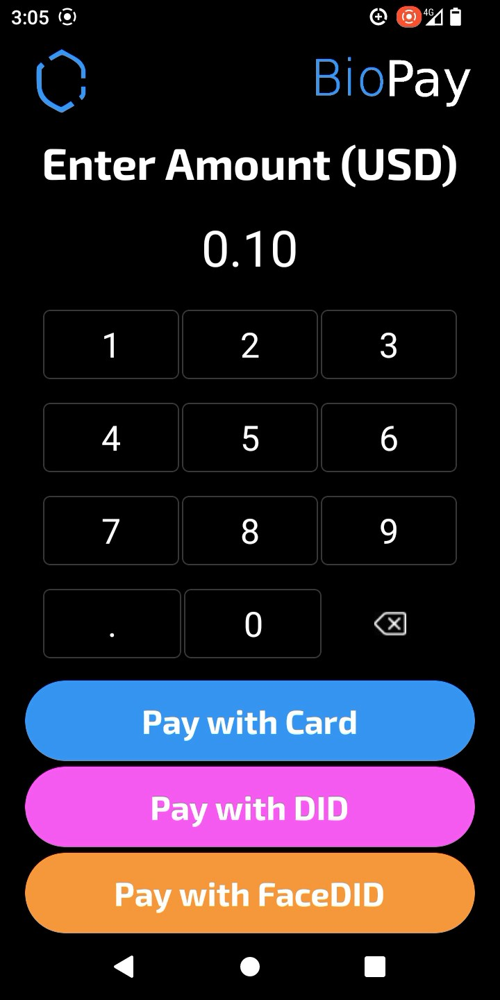 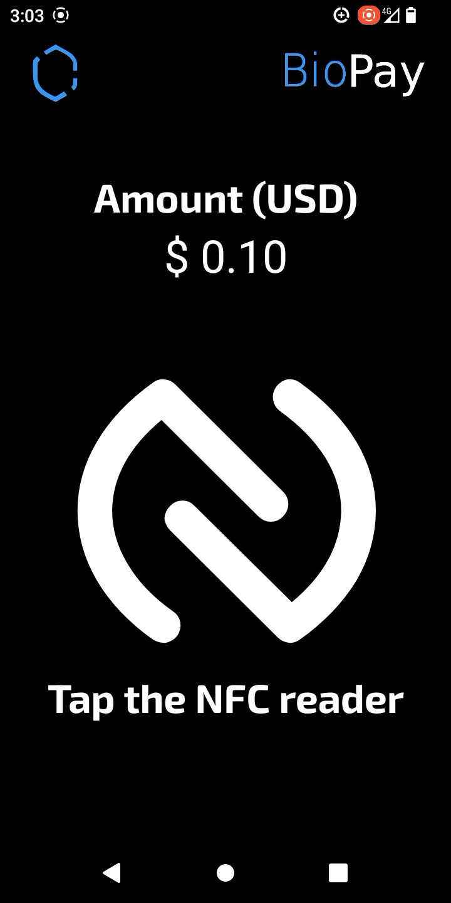 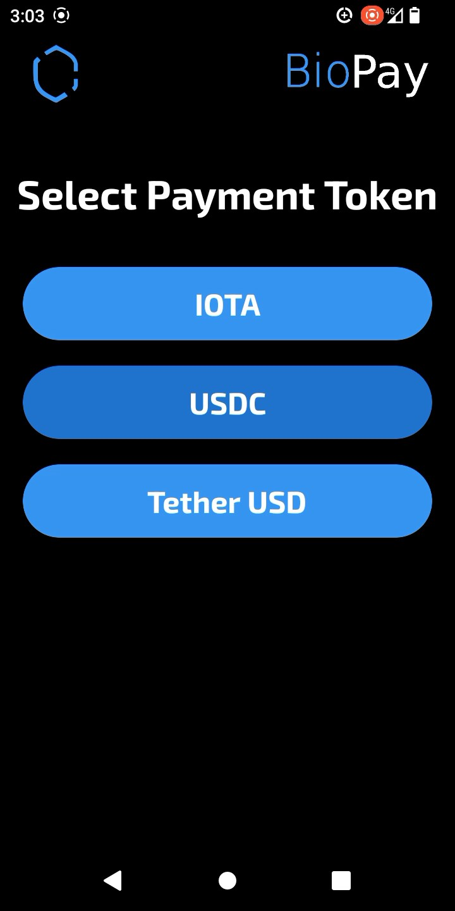

Finally, once the coin to pay has been selected, we can see the status in the testnet explorer, if the hardware allows it, print the receipt for the customer or return to the main menu to make another payment.

 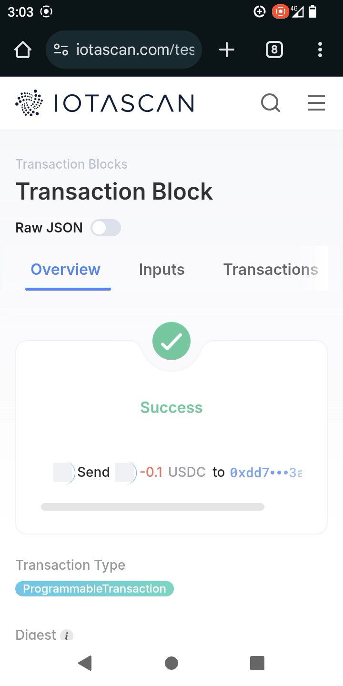 

All technical implementations for transactions are included here.

- [TAB CODE](./biopay-app/src/screens/paymentWallet/paymentWallet.js)
- [READ CARD CODE](./biopay-app/src/screens/main/components/readCard.js)
- [CLOUD TRANSFER](./cloud/cloudFunctions/transfer.js)

## FaceDID and DID:

As part of IOTA's new technologies, we created a new way of identifying users based on the IOTA identity framework, using only the user's face. Although this technology is not new, since there are countries like China that have already implemented it [4](#references), it had never been attempted through Decentralized Identifiers.

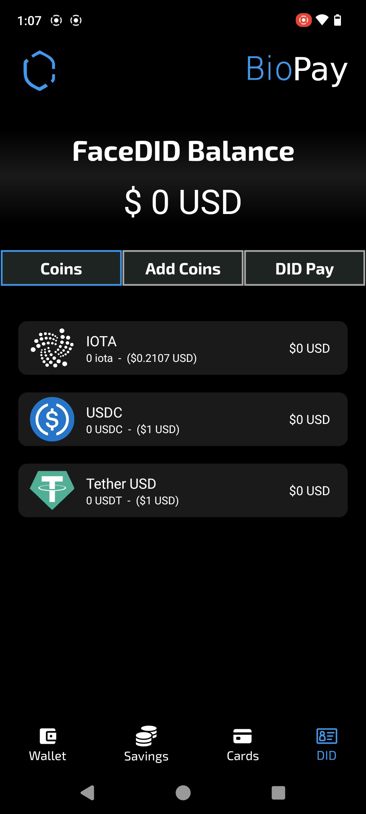 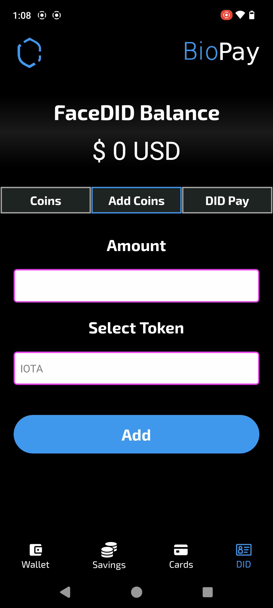 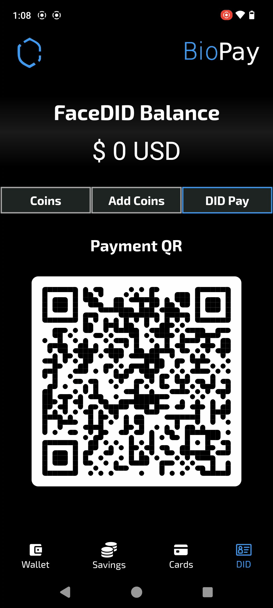

### DID Payment:

Payment via QR has 3 main steps.


---

- QR Generation: First, a single-use QR code is created so that the information can reach the payment device (the user's smartphone) from the payment app (the point of sale). This is done through a unique nonce.

    ```javascript
    const Accounts = db.collection("payments");
    const nonce = req.body.nonce;
    const did = req.body.did;
    const query = await Accounts.where("nonce", "==", nonce).get();
    if (!query.empty) {
        throw "Query Empty";
    }
    let dataFrame = {
        nonce,
        did
    };
    await Accounts.doc(nonce).set(dataFrame);
    res.send({res: "ok"});
    ```
- DID Validation: Once we obtain the DID associated with the user, we perform a validation of the user's DID with their onchain identity when their registration was created.

    ```javascript
    const { did, amount, to, coin } = req.body;
    const Accounts = db.collection("bioPayDID");
    const query = await Accounts.where("did", "==", did).get();
    if (query.empty) {
        throw "Query Empty";
    }
    const holderJSON = query.docs[0].data();
    const { keyId, publicKeyJwk, document, id } = holderJSON;
    const { identityClient } = await loadDID({
        keyId,
        publicKeyJwk,
        document,
        id,
    });
    const loadedDID = IotaDID.fromJSON(did);
    await identityClient.resolveDid(loadedDID);     
    ```
- Transaction: Once we've performed both validations, we have sufficient evidence that the person's identity is correct, so thanks to that we can carry out the transaction from the user's wallet.

    ```javascript
    const { publicKey, privateKey } = holderJSON;
    const privateKeyBuffer = decodeIotaPrivateKey(privateKey);
    const signer = Ed25519Keypair.fromSecretKey(privateKeyBuffer.secretKey);
    const transaction = await createTx({
        publicKey,
        amount: epsilonRound(parseFloat(amount), 9) * Math.pow(10, 9),
        to,
        coin,
    });
    const result = await client.signAndExecuteTransaction({
        signer,
        transaction,
    });
    const receipt = await client.waitForTransaction({ digest: result.digest });
    res.send(
        JSON.stringify({
            digest: receipt.digest
        })
    ); ~   
    ```

All technical implementations for this feature are included here.

- [DID VALIDATION](./cloud/cloudFunctions/transfer.js)

### FaceDID Payment:

Payment via face has 3 main steps.


---

- Face Recognition: First, a photo of the person's face is taken, and through our AI, we obtain the result of the person's DID. This AI already has an Antispoofing algorithm implemented to prevent malicious actors from making the detection.

    ```python
    @app.post("/findUser", dependencies=[Depends(check_api_key)])
    async def findUser(item: ItemFind):
        random_string = os.urandom(32).hex()
        userImage = base64.b64decode(item.image)
        userImage = Image.open(BytesIO(userImage))
        userImage.save(f'deepface/temp/{random_string}.jpg')
        try:
            result = DeepFace.find(img_path= f'deepface/temp/{random_string}.jpg', db_path='deepface/db', anti_spoofing = True)
            return {"result": result[0].identity[0].split('.')[0].split('/')[2]}
        except ValueError as e:
            return {"result": False}
        finally:
            os.remove(f'deepface/temp/{random_string}.jpg')
    ```
- DID Validation: Once we obtain the DID associated with the face, we validate the user's DID with their on-chain identity when their registration was created.

    ```javascript
    const { did, amount, to, coin } = req.body;
    const Accounts = db.collection("bioPayDID");
    const query = await Accounts.where("did", "==", did).get();
    if (query.empty) {
        throw "Query Empty";
    }
    const holderJSON = query.docs[0].data();
    const { keyId, publicKeyJwk, document, id } = holderJSON;
    const { identityClient } = await loadDID({
        keyId,
        publicKeyJwk,
        document,
        id,
    });
    const loadedDID = IotaDID.fromJSON(did);
    await identityClient.resolveDid(loadedDID);     
    ```
- Transaction: Once we've performed both validations, we have sufficient evidence that the person's identity is correct, so thanks to that we can carry out the transaction from the user's wallet.

    ```javascript
    const { publicKey, privateKey } = holderJSON;
    const privateKeyBuffer = decodeIotaPrivateKey(privateKey);
    const signer = Ed25519Keypair.fromSecretKey(privateKeyBuffer.secretKey);
    const transaction = await createTx({
        publicKey,
        amount: epsilonRound(parseFloat(amount), 9) * Math.pow(10, 9),
        to,
        coin,
    });
    const result = await client.signAndExecuteTransaction({
        signer,
        transaction,
    });
    const receipt = await client.waitForTransaction({ digest: result.digest });
    res.send(
        JSON.stringify({
            digest: receipt.digest
        })
    ); ~   
    ```

All technical implementations for this feature are included here.

- [FACE RECOGNITION](./cloud/faceRecognition/main.py)
- [DID VALIDATION](./cloud/cloudFunctions/transfer.js)

### Payment Example:

The merchant can easily execute a payment by opening the payment tab. The payment process remains the same as making a payment at any current POS—simply enter the amount in dollars, and instead of swiping a card, the customer or merchant selects the coin they wish to pay with. The transaction is authenticated using FaceDID, a facial recognition-based payment system, ensuring a seamless and secure checkout experience.

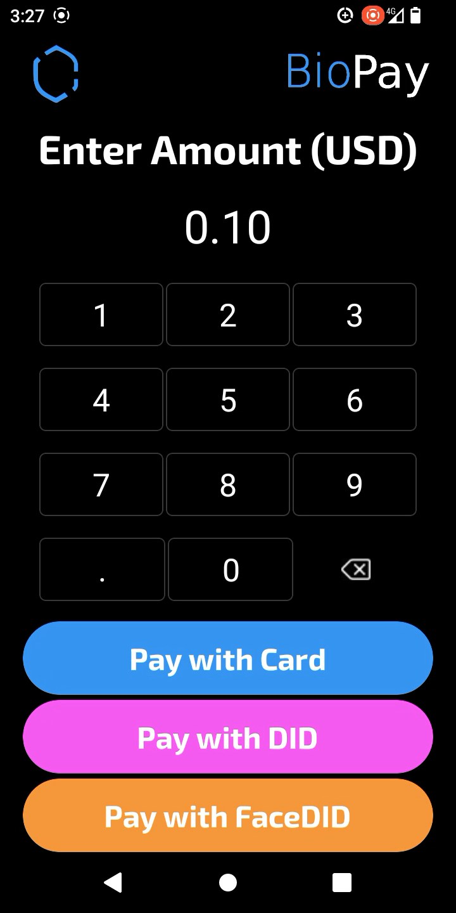 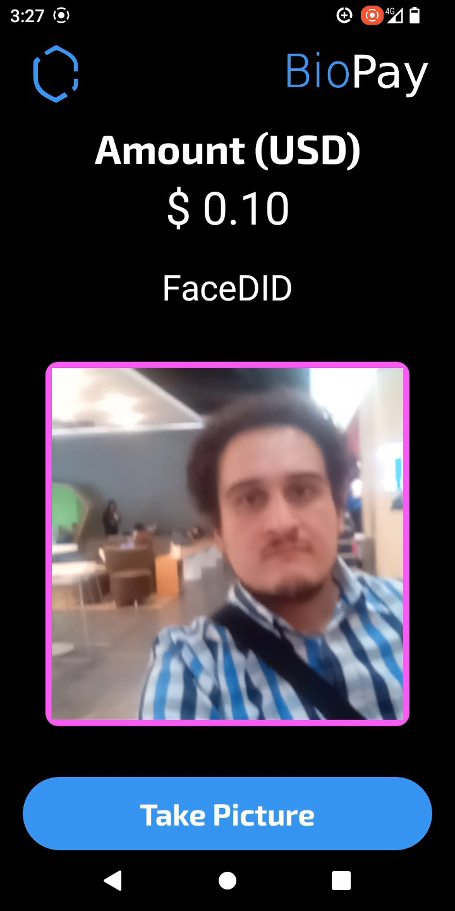 

Finally, once the coin to pay has been selected, we can see the status in the testnet explorer, if the hardware allows it, print the receipt for the customer or return to the main menu to make another payment.

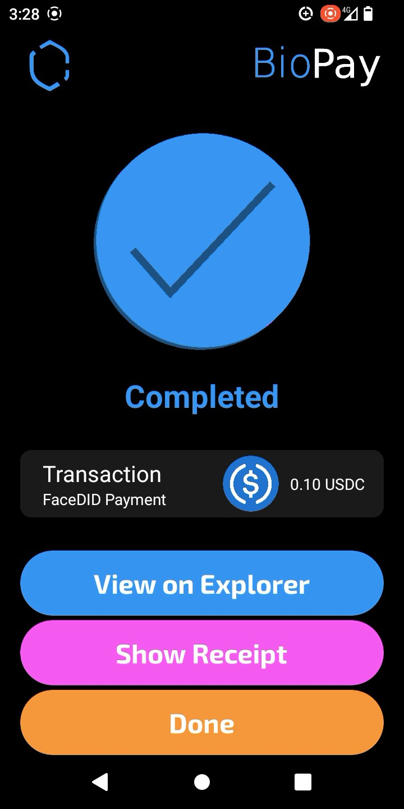 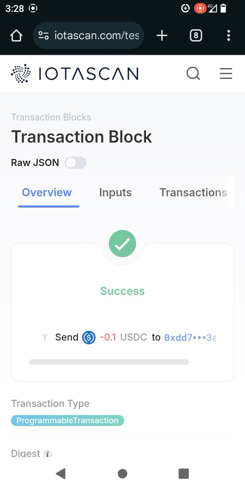 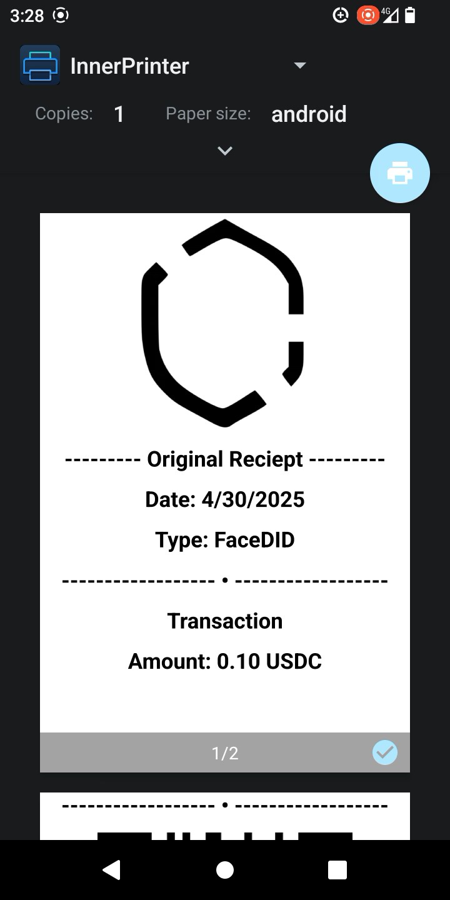

All technical implementations for transactions are included here.

- [TAB CODE](./biopay-app/src/screens/paymentWallet/paymentWallet.js)
- [FACE RECOGNITION](./cloud/faceRecognition/main.py)
- [DID VALIDATION](./cloud/cloudFunctions/transfer.js)

# References:

1. https://cointelegraph.com/news/stablecoin-issuer-circle-partners-sony-blockchain-lab-usdc-expansion
2. https://www.triple-a.io/cryptocurrency-ownership-data
3. https://medium.com/@androidcrypto/talk-to-your-credit-card-android-nfc-java-d782ff19fc4a
4. https://www.bitdefender.com/en-us/blog/hotforsecurity/alipay-introduces-facial-recognition-for-payments-in-china

