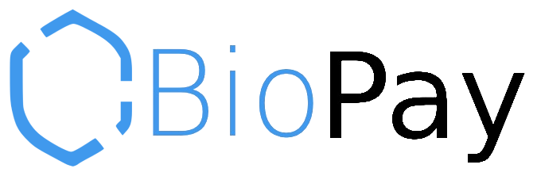
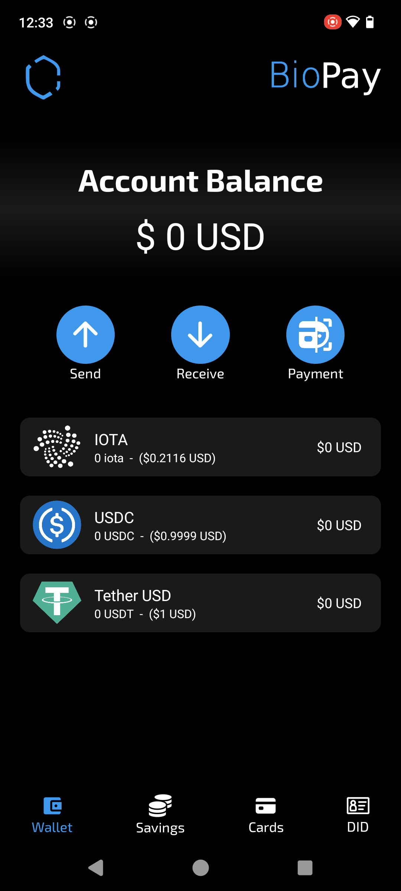
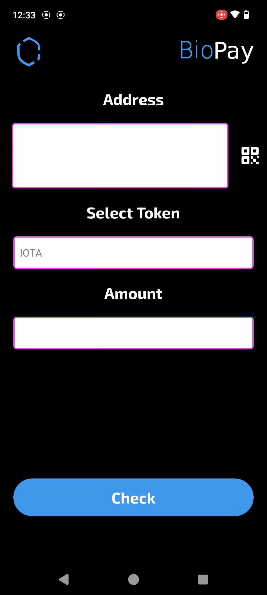
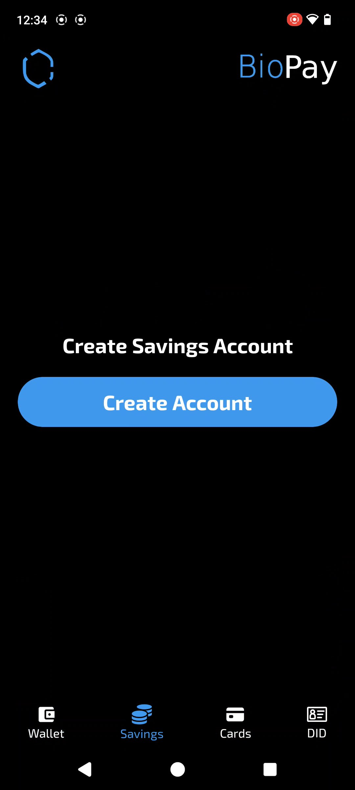
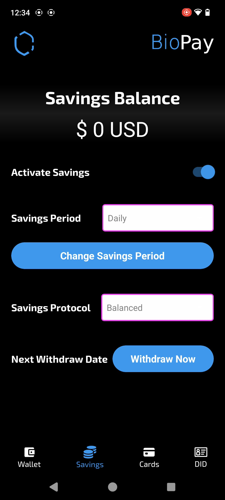
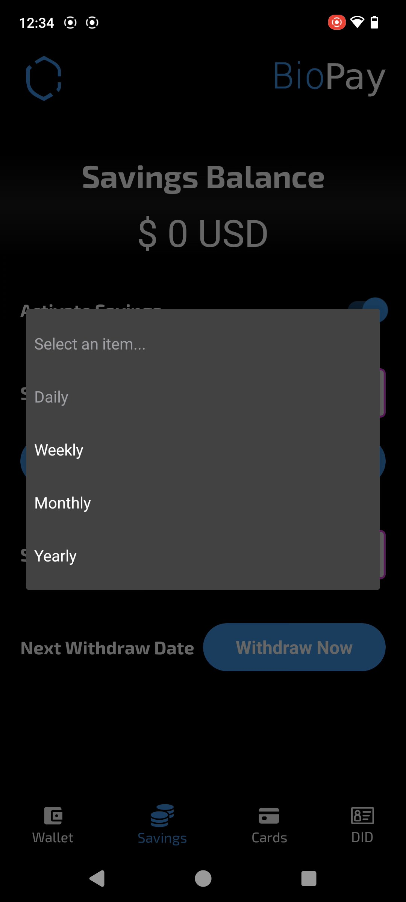
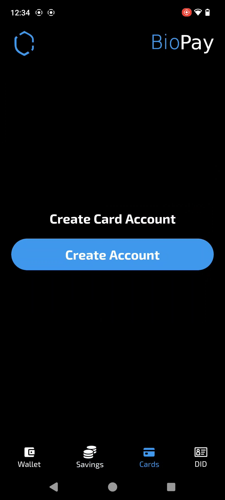
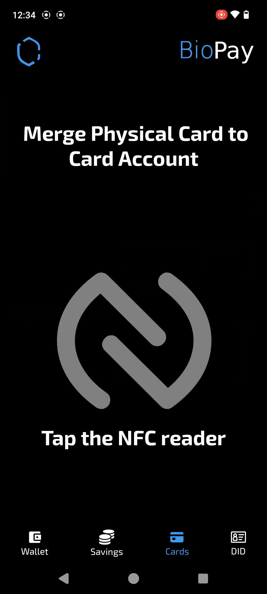
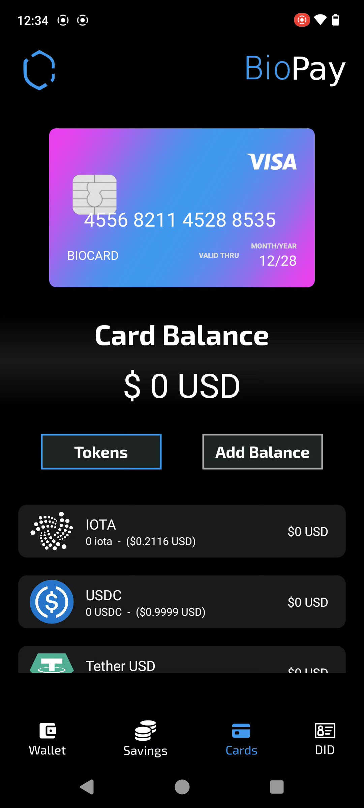

# BioPay-IOTA
 
Secure, with face decentralized identity, smart savings, and easy card payments—powered by IOTA.



## Fast Links:

WALLET CODE: [CODE](./biopay-app/)

PLAYSTORE LINK: [LINK](https://play.google.com/store/apps/details?id=com.altaga.biopay.iota)

VIDEODEMO: [VIDEO](pending...)

# System Diagram:

## IOTA Services:


- IOTA:
  - IOTA Identity: Este framework nos permite crear identidades decentralizadas, las cuales nos abren las posibilidades de crear formas inovadoras de realizar pruebas de validacion e incluso zk proofs.
  - IOTA TS SDK: Mediante este framework realizamos todas las conexiones a la red de IOTA con el fin de realias transacciones, validacion de identidad y todos los pagos.
- VM GPU:
  - Deepface API: Esta API nos permite de forma sencilla realizar reconocimiento facial de los usuarios junto con la valicacion de identidad mediante el DID, nos permite relizar pagos unicamente con el rostro del usuario.

# Features:

Now we are going to describe the main features of our application as well as the technical implementation that these have in relation to IOTA technologies.

## Main Account (non-custodial):

Like any wallet on the market, we first had to cover its basic functions. In this case, it is being able to manage the user's crypto assets, as well as the functions of receiving or sending them. In this case, the implementation of USDC and USDT is a priority. Since these are stablecoins, they provide us with the savings and adoption capacity that we seek to solve. [1](#references)



All technical implementations for main wallet are included here.

- [TAB CODE](./biopay-app/src/screens/main/tabs/tab1.js)

## Send Tokens:

All assets held by this wallet are fully available to the user.



Todas las coins que tenga esta wallet podran ser transferidas de forma sencilla mediante Send, sin embargo el codigo para mandarlas varia de coin nativa IOTA y todas las demas coins.

- Send Coins:
    ```javascript
    async createTx(transaction) {
        // Create a new transaction object
        const tx = new Transaction();

        // Determine which coin to split based on the transaction coin type
        let coinToSplit;
        if (transaction.coin === blockchain.tokens[0].coinType) {
        // If the coin type is the primary gas coin IOTA, use tx.gas object
            coinToSplit = tx.gas;
        } else {
            // Otherwise, retrieve all coins of the specified type from the client
            const coins = await this.client.getAllCoins({
                owner: this.context.value.publicKey,
            });

            // Filter the coins to find the primary coin and any additional merge coins
            const [primaryCoin, ...mergeCoins] = coins.data.filter(
                coin => coin.coinType === transaction.coin,
            );

            // Create a primary coin input for the transaction
            const primaryCoinInput = tx.object(primaryCoin.coinObjectId);

            // If there are additional coins objects, merge them into one
            if (mergeCoins.length) {
                tx.mergeCoins(
                    primaryCoinInput,
                    mergeCoins.map(coin => tx.object(coin.coinObjectId)),
                );
            }

            // Set the coin to split to the primary coin input
            coinToSplit = primaryCoinInput;
        }

        // Split the coin into a new coin with the specified amount
        const [coin] = tx.splitCoins(coinToSplit, [parseInt(transaction.amount)]);

        // Transfer the new coin to the recipient
        tx.transferObjects([coin], transaction.to);

        // Return the newly created transaction object
        return tx;
    }
    ```

All technical implementations for transactions are included here.

- [SEND COINS](./biopay-app/src/screens/sendWallet/sendWallet.js)

## Smart Savings:

One of the missions of our application is to encourage constant savings, this is normally done through financial education and good consumption habits. However, we go one step further, we make small savings in each purchase and transaction that the user makes.

  

The savings account has a couple of customizable functions.

- Activate Savings: This switch allows you to turn the savings account on and off, so that the user can stop attaching savings transactions to each purchase.

- Savings Period: This drop-down menu allows the user to set a savings goal, whether daily, weekly, monthly or yearly. NOTE: For now it is possible to change it without limitations, but we do not want the user to be able to remove the fixed date of their savings until the deadline is met.

- Savings Protocol: This drop-down menu gives us two options, percentage savings, which will take the percentage that we configure in each purchase or smart savings.

All technical implementations for savings wallet are included here.

- [TAB CODE](./biopay-app/src/screens/main/tabs/tab2.js)

### Savings Protocol:

- Balanced Protocol, this protocol performs a weighted rounding according to the amount to be paid in the transaction, so that the larger the transaction, the greater the savings, in order not to affect the user. And this is the function code:

    ```javascript
    export function balancedSavingToken(number, usd1, usd2) {
        const balance = number * usd1;
        let amount = 0;
        if (balance <= 1) {
            amount = 1;
        } else if (balance > 1 && balance <= 10) {
            amount = Math.ceil(balance);
        } else if (balance > 10 && balance <= 100) {
            const intBalance = parseInt(balance, 10);
            const value = parseInt(Math.round(intBalance).toString().slice(-2), 10);
            let unit = parseInt(Math.round(intBalance).toString().slice(-1), 10);
            let decimal = parseInt(Math.round(intBalance).toString().slice(-2, -1), 10);
            if (unit < 5) {
            unit = '5';
            decimal = decimal.toString();
            } else {
            unit = '0';
            decimal = (decimal + 1).toString();
            }
            amount = intBalance - value + parseInt(decimal + unit, 10);
        } else if (balance > 100) {
            const intBalance = parseInt(Math.floor(balance / 10), 10);
            amount = (intBalance + 1) * 10;
        }
        return new Decimal(amount).sub(new Decimal(balance)).div(usd2).toNumber();
    }
    ```

- Percentage protocol, unlike the previous protocol, this one aims to always save a percentage selected in the UI.

    ```javascript
    export function percentageSaving(number, percentage) {
        return number * (percentage / 100);
    }
    ```

All technical implementations for savings protocols are included here.

- [SAVINGS PROTOCOLS](./biopay-app/src/utils/utils.js)

## Web3 Card:

Part of people's daily adoption of crypto is being able to use it in the same way they use their smart phone or card to make payments, but without neglecting the security and decentralization of crypto. [2](#references)

  

### Contactless Payment:

Payment cards are not just a traditional NFC chip, in fact they are more like small computers with installed programs, which run in milliseconds at the time the chip is being scanned. [3](#references)


So we implemented this card reading to be able to read the sensitive data of the payment cards and with this be able to generate a virtual card that could be used for crypto payments.

All technical implementations for this feature are included here.

- [READ CARD CODE](./biopay-app/src/screens/paymentWallet/components/readCard.js)

#### Payment Example:

The merchant can easily execute a payment by opening the payment tab. The payment is the same as making a payment at any current POS, simply by entering the amount in dollars, swiping the card and either the customer or the merchant selecting the token they wish to pay with.

  

Finally, once the token to pay has been selected, we can see the status in the testnet explorer, if the hardware allows it, print the receipt for the customer or return to the main menu to make another payment.

  

All technical implementations for transactions are included here.

- [TAB CODE](./biopay-app/src/screens/paymentWallet/paymentWallet.js)
- [READ CARD CODE](./biopay-app/src/screens/main/components/readCard.js)
- [CLOUD TRANSFER](./)

## FaceDID:


# References:

1. https://cointelegraph.com/news/stablecoin-issuer-circle-partners-sony-blockchain-lab-usdc-expansion
2. https://www.triple-a.io/cryptocurrency-ownership-data
3. https://medium.com/@androidcrypto/talk-to-your-credit-card-android-nfc-java-d782ff19fc4a
4. https://stripe.com/en-mx/resources/more/text-to-pay-101-what-it-is-how-it-works-and-how-to-implement-it

